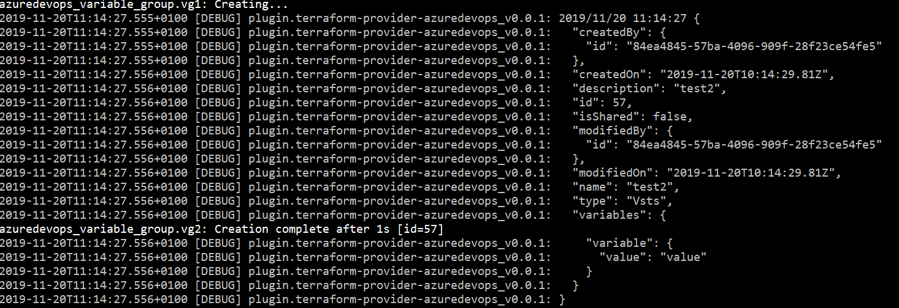

# Debugging your Terraform Provider

Terraform runs providers in their own processes and they only run for a fraction of a second before exiting. Terraform captures stdout and stderr from the provider. This architecture tends to limit the debugging techniques available. The note describes a coupler of techniques that might be useful.

## Option 1 - Avoid debugging in Terraform

You can avoid debugging your provider in Terraform by factoring your code so that your business logic can be run outside of Terraform. Then the only code that might need in-process debugging is a small amount of Terraform glue code.

## Option 2 - Use Terraform Logging instead of the Debugger

Use Terraform logging to debug your code. (TBD: write this section).

```sh
export TF_LOG=DEBUG
```

For display traces information durant the Terraform execution like the passed and response objects from the Azure DevOps API, add logs with the `tfhelpers.PrettyPrint` method like as the example below:

```go
tfhelper.PrettyPrint(createdVariableGroup)
```

And during the Terraform execution we can see the logs:



## Option 3 - Debug acceptance tests from VS Code

With VSCode Golang extension you can also debug the acceptance tests by highlighting the test name and pressing `F5`. 
Or you can use the `codelens` feature of VSCode, which displays the texts `run test` and `debug test` right above every (test) function inside a `_test.go` file.

More information can be found at [Debug Terraform (Azure Devops) Provider with VSCode](https://dev.to/eliises/debug-terraform-azuredevops-provider-with-vscode-c24).


## Option 4 - Attaching a Debugger from VS Code

This somewhat convoluted set of steps will allow you to attach the debugger to your provider and then examine variables, set breakpoints and single step.

First, make sure that your `VS Code` environment is configured for debugging `go` programs. In some casees, you may need to install debugging components. As an example, on the Mac, you might get the error `"xcrun: error: invalid active developer path"`. This may indicate that you need to install the `Xcode Command Line Tools` with the following incantation:

```sh
% xcode-select --install
```

Next, add an `attach-to-process` configuration your `launch.json` file. The following configuration attaches to process id `1234`. This is just a placeholder id that we will replace later.

```json
{
	"version": "0.2.0",
	"configurations": [
 		{
			"name": "Attach",
			"type": "go",
			"request": "attach",
            "mode": "local",
            "processId": 1234   // Put any number here. We will fill this in later.
        }
	]
}
```

Now, we need to modify your provider to pause for a moment to give us time to attach a debugger. Insert a call to `time.Sleep()` somewhere in the codepath before there point where you want to debug, e.g.

```go
func resourceFooCreate(d *schema.ResourceData, m interface{}) error {
	time.Sleep(60 * time.Second)
	fookey := d.Get("fookey").(string)
	d.SetId(fookey)
	return resourceFooRead(d, m)
}
```

This will give you time (60 seconds) to attach the debugger and pause execution or set a breakpoint before the process exits.

Now we're going to start up Terraform with your provider and then quickly get the provider's process id. Start Terraform in one shell:

```sh
terraform apply -input=false
```

and then in another shell, get the process id for your provider. In the following, our provider has `azuredevops` in its name. Substitute a portion of your provider's name here.

```sh
ps | grep azuredevops
 2666 ttys001    0:00.00 grep azuredevops
 2663 ttys007    0:00.08 /Users/mhop/.terraform.d/plugins/darwin_amd64/terraform-provider-azuredevops_v0.0.1
```

We see, from above, that there are two processes with `azuredevops` in their name. One is the `grep` command. We want the other, which has process id `2663`.

Now, working quickly, edit the `launch.json` file, replacing the `1234` with `2663`:

```json
{
	"version": "0.2.0",
	"configurations": [
		{
		"name": "Attach",
		"type": "go",
		"request": "attach",
		"mode": "local",
		"processId": 2663   // Have now added the correct process id.
		}
	]
}
```

Finally, go to the debug toolbar in vscode, select the "Attach" configuration, and then start the debugger (F5).

As soon as the debugger attaches, hit the `pause` button. The debugger should now be attached to the provider. There will be a lot of call stacks, each corresponding to a different thread. You want the one that is paused inside of `time.Sleep()`. Set a breakpoint in the source immediately after the call to `time.Sleep()` and then press the `continue` button (F5). The debugger will stop on your breakpoint when it wakes up from `time.Sleep()`.

You are now ready to debug.

## Option 5 - Use an HTTP Proxy to Impersonate Terraform

TBD - write this section.

Apparently Terraform providers are actually web services. They seem to know whether they were spawned by Terraform or started as top-level processes. When started as a top-level process, a provider prints

> This binary is a plugin. These are not meant to be executed directly.
Please execute the program that consumes these plugins, which will
load any plugins automatically

The strategy here would be to make a process launcher that fools this provider to think it is being started as a web service.

Then connect to it and impersonate Terraform. You may need to use a proxy like `Charles.app` or `fiddler` to better understand how Terraform communicated with its providers. See more on this idea [here](https://github.com/hashicorp/terraform/issues/16752).
